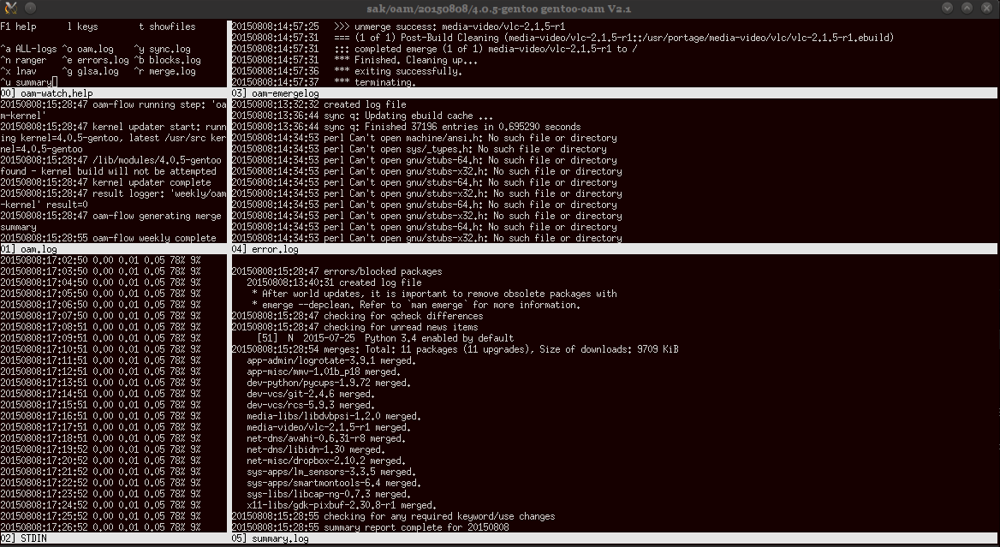

.. oam documentation master file, created by
   sphinx-quickstart on Mon Jul 17 21:50:04 2017.
   You can adapt this file completely to your liking, but it should at least
   contain the root `toctree` directive.

========================
Welcome to oam!
========================

Operations/Admin/Management for gentoo
--------------------------------------

``oam`` can reduce some of the repetition of normal regular maintainance tasks on a gentoo server.

The philosophy is to:

+ automate tasks where it is safe to do so (e.g. merge blockers must be still resolved manually)
+ log all actions and outputs (to aid postmortum analysis and followup manual intervention)
+ provide a dashboard view of the progress of actions and results (to spot issues early)
+ provide an editor preloaded with logs and portage config files ("vim -p" tabs)
+ provide a quick glance summary of merges, blockers and new news items

See :doc:`changelog` for changes in this version.

See :doc:`config` for an overview of how to configuration ``oam``.

Workflows
---------

Workflows are a sequence of steps which are executed in sequence, stopping
at the first failure.

Each step consists of one or more tasks. Generally all tasks in a step must
complete successfully before the next step starts.

For example the `weekly` workflow will run these steps:

+------------+-----------------------------------------+
| Step Name  | Commands                                |
+============+=========================================+
| ``sync``   | -  ``emaint --auto sync``               |
|            | -  ``layman --sync=ALL``                |
|            | -  ``eix-update/eix-remote``            |
+------------+-----------------------------------------+
| ``glsa``   | - ``glsa-check``                        |
+------------+-----------------------------------------+
| ``fetch``  | - ``emerge --fetchonly --update world`` |
+------------+-----------------------------------------+
| ``update`` | - ``emerge --update world``             |
|            | - ``python-updater``                    |
|            | - ``perl-cleaner``                      |
|            | - ``emerge @preserved-rebuild``         |
+------------+-----------------------------------------+
| ``clean``  | - ``eclean distfiles``                  |
+------------+-----------------------------------------+
| ``kernel`` | - ``build a new kernel if necessary``   |
+------------+-----------------------------------------+
| ``qcheck`` | - ``qcheck --all``                      |
+------------+-----------------------------------------+

Steps (or tasks) can be skipped for a particular server (by configuration).

Manual Operations
-----------------
You must still manually:

+ resolve keyword or use flag blockers (see the blocks.log file for a starting point)
+ run `dispatch-conf` when prompted
+ remove obsolete packages manually with: `emerge --depclean`

Features
--------

* simple workflow configuration on a per-server basis - new workflows can be added - built on `invoke <http://www.pyinvoke.org/>`_.
* dashboard display of currently running oam processes built on `multitail <https://www.vanheusden.com/multitail/>`_.
* overall _summary_ of a merge (what merged succesfully, what didn't, glsa's, blockers, qcheck differences, unread news items... etc)
* logs all operations, errors, process output... etc
* multi-server support for starting and monitoring operations
* install via ebuild from the `lmiphay overlay <https://gitweb.gentoo.org/user/lmiphay.git/about/>`_.
* pulls in many useful dependencies as part of the install (genlop, multitail, logrotate, ranger)
* bash shell completion support with `app-shells/bash-completion <http://bash-completion.alioth.debian.org/>`_.

Why should you not use oam?
----------------------------------

* it is not a way to become familar with gentoo (learn emerge... etc first)
* you are happy with your current workflow (stick with your own scripts)

.. toctree::
   :maxdepth: 2
   :caption: Contents:

   quickstart
   config
   changelog
   priorart

Copyright
---------

Copyright (c) 2013-2017 Paul Healy

Permission granted to redistribute it and/or modify it under the terms of the
GNU General Public License version 2.

Indices and tables
==================

* :ref:`genindex`
* :ref:`modindex`
* :ref:`search`
